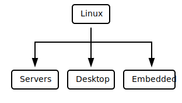
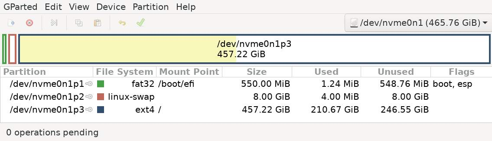
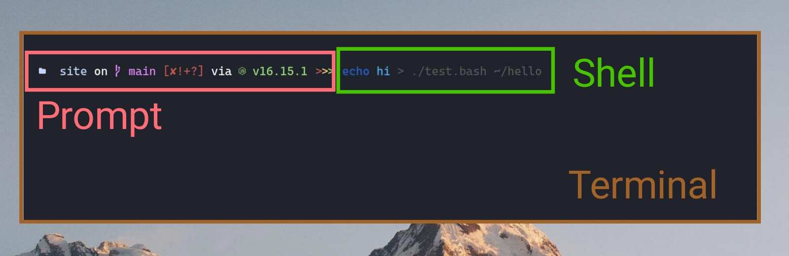

+++
title = "Linux (1/2) - A near surface exploration"
slug = "linux-1"
date = "2022-08-02T13:10:17+05:30"
updated = "2022-08-02T13:10:17+05:30"
+++

<blockquote>
"Intelligence is the ability to avoid doing work, yet getting the work done."

- Linus Torvalds

</blockquote>

Linux is considered to be the most important software project in the history. It is an evergreen example that shows how collaborative development can work, which can be applied to other FOSS projects to the current date.

Traditionally, Linux was known as an OS that is reserved for tech-savvy people. The CLI was intimidating and far too complicated for end-users. But now, everything's changed, various communities have contributed to Linux and it now has a GUI (Graphical User Interface, mouse-based) that can be used just like any Windows or MacOS you're familiar with.

## What is (the point of) Linux & why you should consider it?

Linux is a minimal & clean design which gives you building blocks that are just sufficient enough for doing everything.

* It is lightweight and generally performant.
* Extremely [customizable](https://www.reddit.com/r/unixporn) for specific workflows and hardware requirements.
* Make sures the software you're downloading is coming from a trusted source, so you don't have to identify which 1 of the top 4 google results is legit.
* Is transparent, modular & easy to debug.

<b>Examples of customization / stuffs you can perform (*CLICK ME*):</b>

<iframe id="reddit-embed" src="https://www.redditmedia.com/r/unixporn/comments/m5522z/grub2_had_some_fun_with_grub/?ref_source=embed&amp;ref=share&amp;embed=true&amp;theme=dark" sandbox="allow-scripts allow-same-origin allow-popups" style="border: none;" height="529" width="640" scrolling="no"></iframe>

<iframe id="reddit-embed" src="https://www.redditmedia.com/r/unixporn/comments/pq8m5r/dwm_widgets_two_layout_do_you_like_light_theme/?ref_source=embed&amp;ref=share&amp;embed=true&amp;theme=dark" sandbox="allow-scripts allow-same-origin allow-popups" style="border: none;" height="529" width="640" scrolling="no"></iframe>

<iframe id="reddit-embed" src="https://www.redditmedia.com/r/unixporn/comments/vl09nw/newm_the_best_wayland_compositor_scrolling_tiling/?ref_source=embed&amp;ref=share&amp;embed=true&amp;theme=dark&amp;autoStart=false" sandbox="allow-scripts allow-same-origin allow-popups" style="border: none;" height="431" width="640" scrolling="no"></iframe>

<iframe id="reddit-embed" src="https://www.redditmedia.com/r/unixporn/comments/v7wnp6/hyprland_a_beautiful_wayland_compositor/?ref_source=embed&amp;ref=share&amp;embed=true&amp;theme=dark" sandbox="allow-scripts allow-same-origin allow-popups" style="border: none;" height="412" width="640" scrolling="no"></iframe>

<iframe id="reddit-embed" src="https://www.redditmedia.com/r/unixporn/comments/j3mfc6/i3gaps_ready_for_fall/?ref_source=embed&amp;ref=share&amp;embed=true&amp;theme=dark" sandbox="allow-scripts allow-same-origin allow-popups" style="border: none;" height="529" width="640" scrolling="no"></iframe>

## What is a linux distro & choosing the best for your needs

A linux distro is a set of tools chosen to make your setup start working for a specific usecase instantly.

*Note: A distro is nothing but a collection of tools (referred to as packages), which can be added/removed in any other distro as well, as time will pass you'll notice only thing one differs by another is the package management and the rate of delivery of package updates.*

As a matter of fact, the *worst* part about
* Windows is "privacy" (does random things on behalf, incl. annoying updates).
* Macos is "customization" (too much locked down).
* Linux is "fragmentation" (too many choices to choose from).

Generally speaking, there are uncountable number of [linux-distros available](https://en.wikipedia.org/wiki/List_of_Linux_distributions) on the planet.

<blockquote>
"When you think of the linux kernel like engine in your car, it answers the question of why there are so many linux distros. Some cars are designed to be fast, some for comfort, some are engineered for enterprise, and others are just for fun. As a developer, linux is like a free engine that you can use to make your own car."

- fireship.io

</blockquote>

***[DistroChooser](https://distrochooser.de) is my favourite resource I recommend everyone for choosing their first (or even latter) distro.***

## Installation

Because this article is mainly focused on getting-started, I'm mainly gonna talk about linux for desktops.

The most common way to install any linux-distro for desktop-use is to download the .iso image-file from their respective website and flash it on to a pen-drive using flashing tools (e.g. [balena etcher](https://www.balena.io/etcher) or [rufus](https://rufus.ie/en)), boot from it and follow the guide / on-screen-instructions.

***Bonus:** Because a pen-drive flashing overwrites pen-drive and only one-distro at a time can live on it this way, I personally use [Ventoy](https://www.ventoy.net/en/index.html) a multi-boot usb software that lets me just copy iso file without any external application like a regular file and it becomes ready to boot, plus I can place regular files and continue to use pen-drive as a storage device...*

### Partitioning Notes

At one of the last step in the installation, you'll be prompted to allocate disk space where you're going to install the linux distro. Make sure you make the following partitions in case you choose the manual partitioning (**not recommended for beginners**).

* 1 EFI partition *[fat32]* mounted on `/boot/efi` (>=500M preferred, shared)
* 1 swap partition *[swap]* mounted as `swap` (>=RAM)
* 1 root partition *[ext4]* mounted on `/` (rest of the size)

*Note: Multiple distro install should use seperate swap space, as they are used in hibernation and if reused by another may cause data-loss.*

## Basic components & terminologies

There are exactly 3 things that I think everybody should know while using linux.

### The console

The console is the heart of the Linux OS. Every operation is initiated through it.

Console is a very generic term, and there are actually 3 indivisual-components that builds up a console.
* [**Shell**](https://en.wikipedia.org/wiki/Unix_shell)**:** The ***most important*** part of console, namely interpreter of commands. It is the one which also provides you with tab-completions and syntax-highlighting etc. Learn more about it from [GoalKicker](https://goalkicker.com/BashBook) | [LearnXinYminutes](https://learnxinyminutes.com/docs/bash). e.g. bash zsh fish.
* **Prompt:** The part of visual prompt on the shell just before command. e.g. [starship](https://starship.rs), [powerlevel10k](https://github.com/romkatv/powerlevel10k), ohmyzsh.
* **Terminal:** The graphical interface between the shell and the user, controllling the visual stuffs (fonts, padding, etc). e.g. [kitty](https://sw.kovidgoyal.net/kitty), alacritty, konsole, gnome-terminal, [xfce4-terminal](https://gitlab.xfce.org/apps/xfce4-terminal).

*My personal favourites: fish as shell, starship as prompt & kitty as my terminal application.*

### The file structure

***Everything in linux is a file***, and by everything I mean literally everything! Your disk, your logical partitions, your usb peripheral including your mouse and keyboard, ramdisk, folders, whatever you can ever imagine is a file.

Linux (or unix in general e.g. MacOS) starts laying out filesystem from `/` called root (unlike C: D: multiple drives in windows). Every other partition can be mounted as *(emulated to be)* a directory of this root.

</img>

*Note: There are 4 special folders: /sys /proc /dev /tmp which donot actually exist in disk, which may interest you (as I said earlier everything is a file, not just things residing in the disk)*

### The dotfiles (& DRY principle)

If you ever gone through programming, you may have already heard about the [DRY](https://en.wikipedia.org/wiki/Don%27t_repeat_yourself) (Don't Repeat Yourself) principle, that is when you define a function to do same stuff over and over again.

Same thing applies here, if you already setup your linux once, you shouldn't need to set it up all over again if something went wrong.

Every application in linux which follows something called as Unix Philosophy (discussed in [part 2](@/blog/linux-2.md) of article), places all its configuration as flat text files in the `/home/$USER/.config` folder for particular user or `/etc` for universal.

Those files are referred to as dotfiles, they're a few KiB in size and once you have it backed up, you can throw it to any fresh install with applications installed, and your look, feel & customization will be fully replicated in no-time!

## Getting your hands dirty

* Shell Scripting (bash): Learn it from [GoalKicker](https://goalkicker.com/BashBook) | [LearnXinYminutes](https://learnxinyminutes.com/docs/bash).
* [r/unixporn](https://www.reddit.com/r/unixporn): The home for linux & unix customization.
* [ArchWiki](https://wiki.archlinux.org) & [GentooWiki](https://wiki.gentoo.org): The bible of Linux Troubleshooting and How-To(s).
* [Google](http://google.com): Your best friend!
* [ManPage](https://en.wikipedia.org/wiki/Man_page): Best resource to understand any command, type `man <any-command>` to view. 
  [TLDR](https://dbrgn.github.io/tealdeer): A less intimidating version of man-pages, only lists what's used the most.
* [Linux-kernel-labs](https://linux-kernel-labs.github.io/refs/heads/master/lectures/intro.html): Understand how linux works (bottom up approach).

