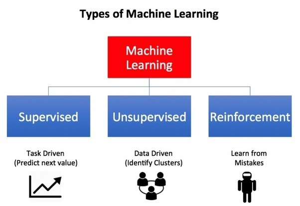

# {{ $frontmatter.title }}

## A strong reason

Recently I read RichDadPoorDad by Robert Kiyosaki, and What every indian should know before Investing by Vinod Pottayil, which gave me 2 different point of views about money:
* Money is not the value, money's value degrades overtime (inflation).
* The absolute value is time and energy.

You're feeding your energy into time to grow your money, whereas the time is taking that away from you at the same time. Which is why holding an asset is a must. According to Robert, an asset is like nurturing a tree from the time it was a seed taking alot of effort & carefulness, and later it gives you shade and fruits overtime. He also refer to asset more simply as something that works 24x7 for you and puts money in your pocket overnight while you're sleeping.

Employing someone 24x7 is exploitation1, whereas for **machines** they're meant to be working, idling them still takes away energy, they don't need rest to heal themselves or refresh their energy reserviors after a long workout. So why not utilize machines, and make them work as asset for you while they're idling?

1. Employing many for certain time is a business, out of topic for this post.

## Machine Learning (ML)

Machine Learning is a formally a branch of DataScience.

A ML Model is a set of rules given to the machine so that it repairs its logic to perform certain task, without being explicitly programmed.

This creates possibility to train a machine to do anything that we do not currently have an accurate algorithm for. Hence for example displacing an object from an image while replacing it with background that looks real.

## Types based on the goals

* **Supervised:** Best approximate the function to produce given outputs for given inputs.
* **Unsupervised:** Find similarity and differences between data points.
* **Reinforcement:** Find a suitable action model that would maximize the total cumulative reward of an agent (e.g. score of a game). Read more about reinforcement learning [here](https://towardsdatascience.com/reinforcement-learning-101-e24b50e1d292).

<!--
TODO: Sort out resources

Importance of hidden layers (DL): https://towardsdatascience.com/how-neural-networks-solve-the-xor-problem-59763136bdd7
Rule of Thumb to choose number of hidden layers (DL): https://stats.stackexchange.com/a/136542

https://towardsdatascience.com/introduction-to-various-reinforcement-learning-algorithms-i-q-learning-sarsa-dqn-ddpg-72a5e0cb6287
https://www.learndatasci.com/tutorials/reinforcement-q-learning-scratch-python-openai-gym/#:~:text=Reinforcement%20Learning%20will%20learn%20a,highest%20cumulative%20long%2Dterm%20reward.
-->
