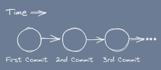
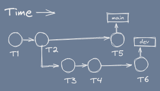
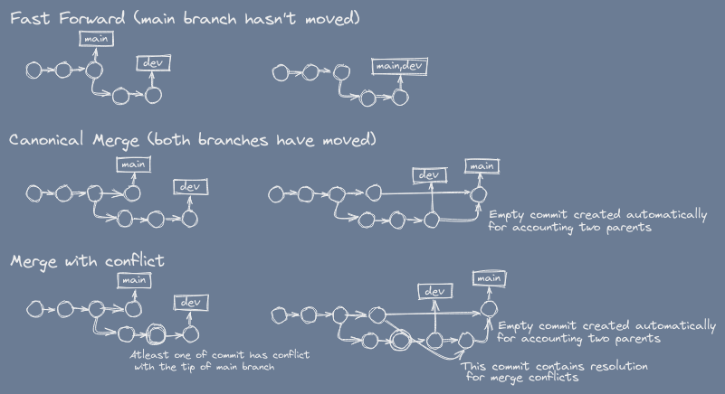
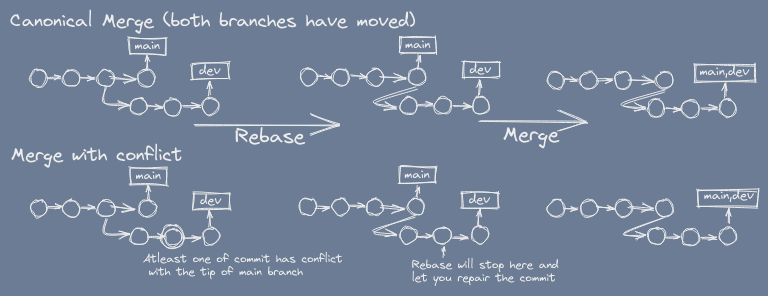

# Using git for effective collaboration

Most important part of this blog post is [fixing your mistakes](#fixing-mistakes) section, the whole blog post slowly builds up to there. Unleashing git to leverage to your advantage and overcoming any fear to use it by learning to fix anything that could ever possibly go wrong.

## A quick recap

This is everything you'd need to know to get started with the blog post.

1. `git add .` | `git add -u` | `git add <file|folder>` doesn't _inherently do anything_.
    - `.` refers to everything (equivalent to `.* *`).
    - `-u` adds files which are modified, but not any new (untracked) files.
2. `git commit -m 'msg'` makes a checkpoint from the items added using `git add`.
    { style="display: block; margin: 0 auto; }
3. git push - syncs remote with local state.
    - Checkout [my last article on git](https://animeshz.github.io/site/blogs/git.html#installation) for setting up accounts on git and git remotes for first time if you're unable to push.

## Branch

Branches allows independence of commits.

That is, `main` can progress without worrying about `dev`, and `dev` can progress without any dependence on changes to `main`.

### Creating and Checking Branches

* `git checkout -b dev` creates a new branch `dev` and checkout that branch.
* `git checkout main` checkout (existent) branch `main`.
* `git branch` to see all branches and see which one is checked out.
* `git branch -a` --''-- including remote branches.

After changing the branch, add / commit / push and everything else works the same.

<b style="font-family: 'Inter var', Inter;">Note:</b> `git switch` behaves quite similar to `git checkout`, but it lacks some of the features, which we'll talk about in the main section of this blog post [fixing your mistakes](#fixing-mistakes).

I'll recommend sticking with `git checkout` for now.

## Merging and Rebasing

The prime purpose of branching is to maximize parallel work, by effectively branching out an independent timeline, making sure that the `main` branch is safe from any experimental changes.

After the feature's been completely implemented, we may want to incorporate the changes into the `main` branch however, and that process is known as `merge` in git.

### To merge

We can either

1. `git checkout main && git merge dev`
2. Send a PR (or MR in gitlab) from `dev` to `main` (2nd person), and accept it.

Commands are quite easy, but the situtation may not be.

::: info TIP
`git pull [remote branch]` is a shorthand for `git fetch [remote branch] && git merge remote/branch`
:::

### Situations on merge

<b style="font-family: 'Inter var', Inter;">Fast-Forward:</b> The best case scenario is when `main` hasn't moved yet, in that case merge simply fast-forwards the `main` pointer (we call it ref) to match up with `dev`'s ref.

In rest of the cases, we get atleast 1 redundant commit.

<b style="font-family: 'Inter var', Inter;">Merge with conflict:</b> is a special case, where same lines of same file's been edited by both the branches. And since we're considering main is stable, we'd say some commit on `dev` branch has conflict with tip of the `main` rather than vice versa regardless which branch committed first in the time.

For merging with conflicts, considering main is stable branch, we'd want to merge `main` into `dev` first and resolve conflicts then merge `dev` into `main`. As in PRs you don't ask the repository owner to resolve conflicts rather you the holder of PR, the holder of dev branch, resolve conflicts on your branch.

### Rebase

Problem with non fast-forward merge is that the git history can get really really messy.

In the later stage you'll come to know about `git bisect`, a binary-search for finding bugs in the history, if history is linear -> well-n-good, but what if there's too many quadrilateral in there like in the above diagram? Well, you guessed it right, it'll hit you hard at that time.

It also creates a problem when you want to reorder the commits (yes you can! we'll be discussing it in [fixing your mistakes](#fixing-mistakes)), the multi-parent commits will be really really disgusting.

`git rebase` comes to rescue here, _an intermediatery step_ that'll prevent formation of those redundant commits on merge. Precisely by re-basing the parent of the exclusive commits to tip of main.

To do this, you'd have to `git checkout dev && git rebase main` before the merge step.

How beautiful!

The merge (2nd step) has just became fast-forward.

The history becomes linear!

::: info TIP
Its always better to rebase before merge.

There's no harm, only the timestamp on commit changes.

`git pull --rebase` is always better than `git pull` if you care about a good git history.
:::

## Fixing mistakes

Yeah, The main topic of the blog post!

Before starting I wanna talk about refs.

### Refs

Refs can be:

- A commit hash (e.g. `c80eb9`, that you see typically on `git log`).
- A branch name.
- A tag name.
- Special variable `HEAD` (pointing to checked branch) or its parents referred by `HEAD~n`.

All of these are refs.

`git checkout` is the command that inherently moves the `HEAD` ref.

The `HEAD` is responsible for the directory structure you see. Its the internal detail of changing branches. `HEAD~1` refers to the 2nd last commit on current branch (current HEAD's parent), and so on.

<b style="font-family: 'Inter var', Inter;">Tag:</b> are similar to branch, but `git commit` doesn't increment the tag pointer unlike branch. Tag always point to a constant commit. Its automatically created for creating releases (for versions).

A `git checkout` on anything other than a branch name, moves repository in a [Detached HEAD state](https://www.git-tower.com/learn/git/faq/detached-head-when-checkout-commit), see the linked-reference, I don't want to talk about it much here.

### Interactive Rebase (the real fix)

This is where you fix your mistakes!

Anything from

- Wrong message in commits.
- Missed to incorporate some changes on some commits.
- Committed by mistake and new commits have been added over it.
- Reordering of commits.
- Wrong author in commit.

all of these can be fixed, by one single command: `git rebase -i HEAD~n` (or `git rebase -i --root`).

This command, is the ultimate answer to everything!

This command will open a file something like this (on editor set by environmental variable `$EDITOR`):

This is ultimate place you can do whatever you want!

Move the line to reorder the commit, as if one commit that has been added later in the time appears to came first.

Delete the line to make a commit disappear from the course of history.

put `r` or `reword` in front of a line to rename the commit (after saving and exiting this file).

put `f` or `fixup` or `s` or `squash` in front of line to squash commit in this line to just above commit - 2 commits into 1 commit (if you forget some changes to commit add a new commit and perform this!). `squash` let's you change the commit message, whereas `fixup` doesn't.

put `e` or `edit` in front of line to stop rebase at that commit let you change, run `git add .` and `git rebase --continue` afterwards to edit commit in between the history wow!

these are the major controls, you can also explore `exec` and `break` if you like!

## Fixing mistakes over fixing mistakes

`git rebase` is a dangerous operation, likewise `git checkout`, as both of them moves `HEAD` pointer (or ref, whatever you wanna call it), which is directly connected to the state of repository, its populates your folder with bunch of files you expect in the project.

Because of this, with accidental rebase option, you may overwrite the branch & loose the previous state of repository.

This is where `git reflog show` comes in!

It records every moment when `HEAD` has moved, i.e. there's always a record where HEAD pointed to before you performed _any potentially dangerous operation_, so you're backed up with <b style="font-family: 'Inter var', Inter;">cold water immersion suit</b> so you can never fall in the depth of ocean.

Just do a `git reflog show` and `git reset --hard 76e2269` with the hash you see on the reflog command to reset the repository back to where it was.

## Further reading

Git has a lot more, the `bisect` I mentioned earlier, and more.

See

- [Useful stuffs](https://animeshz.github.io/site/blogs/git.html#other-useful-stuffs) from my last blog post on git (highly recommend).
- [Internals - fundamentals of git](https://towardsdatascience.com/understanding-the-fundamentals-of-git-25b5b7ded3c4) (optional read - i.e. to say understanding it really does any good is subjective - maybe hard and won't be any useful for most people).

If you've come to this point of the post, thanks alot for your attention! You're welcome to visit around the site, I put everything I know here, if not today, will surely on someday.

Backlinks:

- r/git | r/programming
- Linkedin

<!-- TODO: Convert the part below fixing mistakes into gif generated by terminalizer instead of those big code block chunks -->
