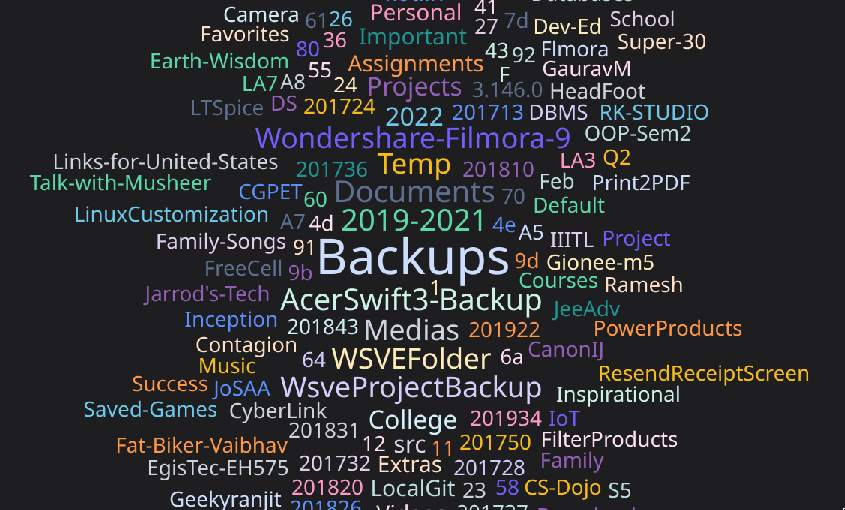

# July 2023

At the time of writing, ~~its been a third of~~ the July has passed. Not much things have been done compared to previous month, but dedicated time for the file reorganization is paying off its ROI.

## Reach out to good old friends

I felt free for the first time with a long summer holiday as a result of finish of compressed semesters going on (mostly) continuous past last 1.5yrs. Reach out to my school mates and friends at my coaching institute, had fun.

## Clean up Emails

I have 7 email, and one even had 43k unreads xD. Pull each mail down to about 200.

## Reorganize all my files

With HDD going way too larger, and information getting hidden over layers of folders, it was a necessity to reorganize the knowledge and other stuffs.

And since I recently got to know about [Johnny Decimal](https://johnnydecimal.com), I move forward to organize all the information stored since 2014.

::: info
The tag's word-could vue component at /blogs (on this site) came really handy.

Just edited the `index-generator.org` at root of my project to get a word-cloud view of all the nested folders out there in the HDD.

```org
#+name: tag-list
#+begin_src sh :results output

# sort ~/dirs | sed -e 's/ /-/g' -e "s/'/\\\'/" | uniq -c | awk "{print \"{name: '\" \$2 \"', value: \" \$1 \"},\"}"
cat ~/hdd-fd-dirs | grep -v '1TB-Mosi' | tr '/' '\n' | sort | sed -e 's/ /-/g' -e "s/'/\\\'/" | uniq -c | awk "{print \"{name: '\" \$2 \"', value: \" \$1 \"},\"}"

#+end_src
```

and it generated a beautiful view for me! Part of which can be shown below:

{ style="max-width: 400px;" }
:::

This was my final JD structure for all my data across my HDD and Laptop, and I'm soon going to make my GDrive to fit this exact same structure.

```md
- 00-09 Home
	- 01 Logseq
	- 02 Documents
		- 02.01 Identification
		- 02.02 Aid
		- 02.03 Certificates
		- 02.04 Academics
		- 02.05 Financial
		- 02.06 Health
		- 02.98 Dad
		- 02.99 Mom
		- unfiltered
	- 03 Downloads
	- 04 Software Vault
		- 04.01 OS
		- 04.02 Games
		- 04.03 Apps
	- 05 References
		- 05.01 Benchmarks
		- 05.02 Bios Key
		- 05.03 Secrets and Config
- 10-19 Media
	- 11 Music
		- unfiltered
	- 12 Movie & Series
		- unfiltered
	- 13 Camera
		- 1403 Origami
		- 1404 Family Photos
		- 1512 Rajasthan Trip
        # ...
		- 2010 My Birthday
		- 2010 Nanaji RIP
		- unfiltered
	- 14 Digital Collection
		- 14.01 Screenshots
		- 14.02 Wallpapers
		- 14.03 Memes
		- 14.04 Illusionistic
		- 14.05 Incredible Videos
		- 14.06 Sound Effects and GIF (NonCopyright)
		- 14.07 Youtube Productions
		- 14.08 Graphics Production
		- 14.09 Discord Emojis
		- 14.10 Avatars
	- 15 Informational Content
		- 15.01 Quotes & Posters
		- 15.02 Books
		- 15.03 Side Hustle Inspiration
- 21-29 Computer
	- 21 Projects
		- 21.01 Main
		- 21.02 Contributing
		- 21.03 Clone
		- 21.04 Freelance
		- unfiltered
	- 22 Toolkit
		- 22.01 Testing
		- 22.02 Debugging
		- 22.03 Other's Backups
	- 29 Templates & Snippets
		- unfiltered
- 31-39 Education
	- 31 Entrance
		- 31.01 Receipts
		- 31.02 Documents
		- 31.03 11th-12th Notes
		- 31.04 Exams
		- 31.99 College Selection
	- 32 B.Tech.
		- 32.01 Receipts
		- 32.02 Documents
		- 32.03 Coursework
		- 32.04 Assignments
		- 32.05 Axios
	- 33 Job Seeking
		- 33.01 Resume
		- 33.02 Approaching
		- 33.03 Future Plannings
		- 33.04 DSA Practise
	- 34 Courses
		- 34.01 Deep Learning Prerequisites: The Numpy Stack in Python V2
		- 34.02 Complete Machine Learning & Data Science Bootcamp 2023
```

That was rough, took me almost 4.5 days to complete, with rigorous 15+ hours of time each day, but it was worth it, the JD's `AC.ID` notation really comes in handy, now I exactly know where I put which thing. [zoxide](https://github.com/ajeetdsouza/zoxide) has been really helpful cli tool to navigate folders instantly.

Want my identification documents? `z 02.01`, want to look at memes `z 14.03`, want camera `z 13`, want college receipts `z 32.01`.

## Data just got turned into Information

With the above organization process, I've found various archived notes about different topics which were previously scatterred, now everthing's under `z 29`.

With this, I've recently started to share my knowledge, in various forms, this small page of [bash tips](https://www.reddit.com/r/linux/comments/14vppt0/some_quick_bash_tips_thought_good_for_share) just got boomed on r/linux, with over 500 upvotes within the first 24 hrs, to my juniors as a member of Axios (our college's technical club) which I'm planning to post in public as well in the coming future gradually.

## Back to college

With eye checkup, and purchasing a formal dress, all the holidays are over now, we transitioned to 3rd year, and intern-season have started before travel. Started doing some DSA problems.

Amazing incident happened, 2 hours before flight got the mail that flight cancelled xD. Alternative flight got booked right away while I was on phone, somehow with refreshes post 10 mins, I got an intersection RPR->IDR->LKO, where delayed flight of RPR->IDR (that was supposed to be at 10:30AM but went 2:00PM) matched up with IDR->LKO flight at 5:30PM. Somehow I reached the college in time.

Rebuilt [resume](https://drive.google.com/file/d/1qY7w-1OMlAGQWaHG3yvSEVZQaik1mS7y/view?usp=drive_link) again, in latex standard format.

Curated more nix resources.

## Started a Nix RFC

[[RFC 0157] More granular control over the system](https://github.com/NixOS/rfcs/pull/157).

Proposing reduction of abstraction and transparency.

So far, only this much has happened till now, most of the days went with blockings such as rainy day and travel. Hoping for more productive next month.
