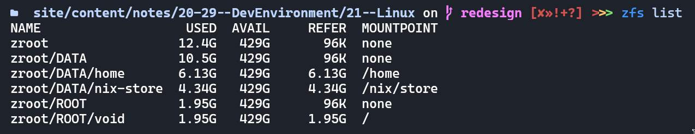

# 21.01 ZFS

ZFS is my current filesystem of choice.

[What is ZFS](https://itsfoss.com/what-is-zfs) is good article.

## Notes

* [Why you should leave 1MiB space before creating any partition](https://superuser.com/questions/1483928/why-do-windows-and-linux-leave-1mib-unused-before-first-partition).
* [ZFS Tuning Guide](https://www.high-availability.com/docs/ZFS-Tuning-Guide) - tuning various parameters that you could get benefit from.
* [Why you shouldn't generally use ZFS deduplication in most-cases](https://www.truenas.com/docs/references/zfsdeduplication).
* [facebook/zstd](https://github.com/facebook/zstd) - zstd and lz4 compression benchmarks and speed compared.
* [All ZFS compression methods compared with different types of benchmark](https://docs.google.com/spreadsheets/d/1TvCAIDzFsjuLuea7124q-1UtMd0C9amTgnXm2yPtiUQ/edit?usp=drivesdk).
* [How do I change the "label" reported by lsblk](https://askubuntu.com/questions/1103569/how-do-i-change-the-label-reported-by-lsblk).
* [How do I determine current size of ARC cache](https://superuser.com/questions/1137416/how-can-i-determine-the-current-size-of-the-arc-in-zfs-and-how-does-the-arc-rel).
* [ZFS doesn't need fsck, how it adds auto-repair, security and integrity](https://klarasystems.com/articles/openzfs-data-security-vs-integrity).
* [ZFS allow you to clone/restore a system over stdio](https://github.com/Stetsed/.dotfiles/blob/main/.bin/install/05-restore.sh#L70).

## Some quick points

* My current installation reports 1.48x compression ratio (using lz4). This could theoretically go upto 6x with zstd-19 as reported in benchmarks above.

* Higher compression doesn't generally means slower system, ZFS uses ARC caching.
  > Just like writes, ZFS caches reads in the system RAM. They call their read cache the "adaptive replacement cache" (ARC).

  Which generally means frequently accessed items are readily available in RAM and hence you get speed from the RAM, which goes around [25.6GB/s for 3200MHz RAM module](https://www.transcend-info.com/Support/FAQ-292).

* ARC caches can occupy upto 50% of RAM, but they're completely open to give all of 'em back when RAM backpressure increases. You can also clear the cache manually similar to how you do on a non-ZFS system:<br>`echo 3 | sudo tee /proc/sys/vm/drop_caches`.

* Another killer feature of ZFS is that all of the volumes are shared.
  
  See the AVAIL column!

* ZFS also allows you to take snapshots of any subvolume: `sudo zfs snapshot zroot/ROOT/void@17June23` and you got a snapshot at `/.zfs/snapshot/17June23/` you can always revert back to.


## Installation

### My Install History

<details>
<summary style="cursor: pointer;">&gt; Click to view &lt;</summary>

```bash
# Setup a 8-letter hexadecimal hostid (I like a bad food xD)
zgenhostid -f abadf00d

# Cleanup the disk
# blkdiscard is zero-write most-efficient disk clearing method
zpool labelclear -f /dev/nvme0n1 || true
blkdiscard -f /dev/nvme0n1

# Create partitions (boot, swap, zfs root)
sgdisk -n 1:1m:+550m -t 1:ef00 /dev/nvme0n1
sgdisk -L | grep ef00         # ef00 EFI system partition
sgdisk -L | grep -i swap      # 8200 Linux swap
sgdisk -n 2:0:+8G -t 2:8200 /dev/nvme0n1
sgdisk -L | grep -i bf00      # bf00 Solaris root
sgdisk -n 3:0:0 -t 3:bf00 /dev/nvme0n1

mkfs.vfat /dev/nvme0n1p1
mkswap /dev/nvme0n1p2
swapon /dev/nvme0n1p2

# Create a new dataset (zroot)
man zpool-create
man zfsprops
man zpoolprops

zpool create -f -o ashift=12 -O acltype=posixacl -O atime=off -O compression=lz4 -O xattr=sa -O canmount=off -m none zroot /dev/nvme0n1p3

# Create subvolumes in the dataset (zroot/ROOT, zroot/DATA)
man zfs

zfs create -o canmount=off -o mountpoint=none zroot/ROOT
zfs create -o canmount=noauto -o mountpoint=/ zroot/ROOT/void
zfs create -o canmount=off -o mountpoint=none zroot/DATA
zfs create -o mountpoint=/home zroot/DATA/home

zpool set bootfs=zroot/ROOT/void zroot

zfs export zroot
zpool import -N -R /mnt zroot
zfs mount zroot/ROOT/void
zfs mount zroot/DATA/home
udevadm trigger    # force kernel to re-read mount info (optional)

mkdir -p /mnt/boot/efi
mount /dev/nvme0n1p1 /mnt/boot/efi

# Ensure everything is well-n-good
mount | grep mnt

# <connect to internet>
ln -s /etc/sv/dbus /var/service
ln -s /etc/sv/iwd /var/service
ln -s /etc/sv/dhcpcd /var/service
iwctl station wlan0 scan
iwctl station wlan0 connect V2040

XBPS_ARCH=x86_64 xbps-install -S -R https://mirrors.dotsrc.org/voidlinux/current -r /mnt base-system zfs zfsbootmenu linux-headers linux5.18 linux5.18-headers iwd neovim linux-firmware-intel mesa-dri vulkan-loader mesa-vulkan-intel intel-video-accel xf86-video-intel efibootmgr gummiboot-efistub

mkdir -p /mnt/etc/zfs
zpool set cachefile=/etc/zfs/zpool.cache zroot

echo framework > /mnt/etc/hostname
cp /etc/hostid /mnt/etc/hostid
cp /etc/zfs/zpool.cache /mnt/etc/zfs/zpool.cache

# Set keyboard layout & timezone
nvim /mnt/etc/rc.conf
ln -sf /usr/share/zoneinfo/Asia/Kolkata /mnt/etc/localtime

# Setup dracut
cat << EOF > /etc/dracut.conf.d/zol.conf
nofsck="yes"
add_dracutmodules+=" zfs "
omit_dracutmodules+=" btrfs "
EOF

zfs set org.zfsbootmenu:commandline="loglevel=4 acpi_osi='Windows 2020' net.ifnames=0 i915.enable_psr=1 intel_pstate=disable nvme.noacpi=1" zroot/ROOT  # setting on ROOT makes all children inherit the property (useful in multi-boot)

# Generate locales
sed -i '/en_US/s/^#//' /mnt/etc/default/libc-locales
sed -i 's/LANG=.*/LANG=en_US.UTF-8/' /mnt/etc/locale.conf
xchroot /mnt xbps-reconfigure -f glibc-locales

# Add user
xchroot /mnt useradd -m animesh -G network,wheel,video,audio,input
xchroot /mnt chown -R animesh:animesh /home/animesh
xchroot /mnt passwd animesh
sed -i '/%wheel ALL=(ALL:ALL) ALL/s/^#//' /etc/sudoers

# Add mountpoints
blkid
echo "$(blkid | grep nvme0n1p1 | cut -d' ' -f2) /boot/efi vfat defaults 0 0" >> /mnt/etc/fstab
echo "$(blkid | grep nvme0n1p2 | cut -d' ' -f2) none swap defaults 0 0" >> /mnt/etc/fstab

# Configure ZFSBootMenu
cat << EOF > /etc/zfsbootmenu/config.yaml
Global:
  ManageImages: true
  BootMountPoint: /boot/efi
  DracutConfDir: /etc/zfsbootmenu/dracut.conf.d
  PreHooksDir: /etc/zfsbootmenu/generate-zbm.pre.d
  PostHooksDir: /etc/zfsbootmenu/generate-zbm.post.d
  InitCPIOConfig: /etc/zfsbootmenu/mkinitcpio.conf
Components:
  Enabled: false
EFI:
  ImageDir: /boot/efi/EFI/zbm
  Versions: false
  Enabled: true
Kernel:
  CommandLine: loglevel=4 acpi_osi='Windows 2020' net.ifnames=0 i915.enable_psr=1 intel_pstate=disable nvme.noacpi=1
EOF

xchroot /mnt xbps-reconfigure -fa

# Generate EFI entries for booting
man efibootmgr
xchroot /mnt efibootmgr --create --disk /dev/nvme0n1 --part 1 -L "ZFSBootMenu (Backup)" --loader \\EFI\\zbm\\vmlinuz-backup.efi
xchroot /mnt efibootmgr --create --disk /dev/nvme0n1 --part 1 -L "ZFSBootMenu" --loader \\EFI\\zbm\\vmlinuz.efi

umount -n -R /mnt
zpool export zroot
reboot
```

</details>

### Installation References

* [Void Docs - ZFS](https://docs.voidlinux.org/installation/guides/zfs.html)
* [ZFSBootMenu - Step by step installation instructions](https://docs.zfsbootmenu.org/en/latest/guides/void-linux/uefi.html#zfs-pool-creation)
* [Stetsed's install script (Friend @ Framework discord)](https://github.com/Stetsed/.dotfiles/blob/main/.bin/install/01-zfs_install.sh)
* [Some guy's void install script](https://github.com/eoli3n/void-config/tree/master/scripts/install)


## Some useful commands

* `zfs list`.
* `zfs get compressratio zroot`.
* `zpool export zroot && zpool import -N -R /mnt zroot` - import zfs at /mnt, useful for debugging via chroot (e.g. `zfs mount zroot/ROOT/void` can be used).
* `sudo zfs snapshot zroot/ROOT/void@<your-suffix>` - create a snapshot, can be reverted using `zfs rollback` or by ZFSBootMenu.
