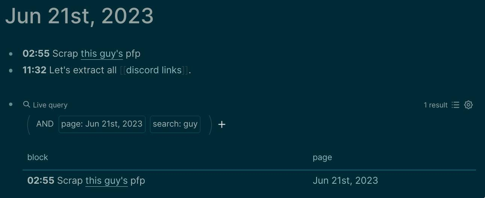

# 91.01 Note Taking

I use [Logseq](https://logseq.com) for all my personal notes. It embraces both [inter-linking](https://docs.logseq.com/#/page/how%20to%20create%20pages%20in%20logseq) and [hierarchical](https://blog.logseqmastery.com/post/logseq-namespaces) approach. It saves everything offline on a local folder.

[What's so special about Logseq?](https://youtu.be/oBtKHwFBn0k) is a great video.

[Mem.ai](https://mem.ai) (paid) and [Tana.inc](https://tana.inc) (free for now) seemed actually really good[^1] aside Logseq.

Single most important part about note-taking is being able to connect your thoughts, precisely when you need them.

> Everything is not packed in the page itself, rather this is an opening door to various links that will point you to the correct resources to find the most suitable solution for yourself. Feel free to navigate to the links in the page for getting most out of it.

## Notes on logseq

* The fundamental unit of information is a block, not a file. Forget moving across files.
* Access all commands using `/`. Insert all types of formattable blocks using `<`.
* Access all the pages using `C-k`.
* Both markdown and emacs org-mode is well supported.
* All types of blocks, pages, rich text document (pdf), video or image are embeddable. Use the same `/` to embed anything, drag-n-drop works too.
* All operations over block can be viewed by right-clicking on block dot (at the very-left).
* Use `Alt+Shift+Up/Down` to move any block up or down.
* Page / Block links can also be viewed / edited on-the-fly by hovering over it.
* [50 Logseq Tips in 6min](https://youtu.be/r_tcDooayOo) is also a great video after understanding these fundamentals.
* [PDF note taking on LogSeq](https://youtu.be/vIDyXyEj_FI?t=445) is very useful.
* Query is very powerful. It's both click-and-build as well as [write-as-a-dsl](https://qwxlea.github.io/#/page/datalog%2Fintro%20to%20datalog).  
  

## Favourite plugins (logseq)

* [Vim Shortcuts](https://github.com/vipzhicheng/logseq-plugin-vim-shortcuts) plugin adds much more than vim shortcuts. You can mark (`<num>m`) or jump-to (`<num>'`) a block. Adds `C-/` for emoji picker, and sg/ss/sh/sy/se to quickly search block under cursor on google/stackoverflow/github/yt/wikipedia.

* [Logseq Markmap](https://github.com/vipzhicheng/logseq-plugin-mark-map) plugin can generate mindmap from the current page.

* [Logseq Quick Capture](https://chrome.google.com/webstore/detail/logseq-quick-capture/hdpmdgiddmjppbeahnglgagndmahlanc) browser extension lets you quickly capture things in your journal with single-click.

## References

for building a good structured note-taking and self-management system.

* [Getting Things Done + Personal Knowledge Management](https://fortelabs.com/blog/gtd-x-pkm). ⭐
* [Johnny Decimal System](https://johnnydecimal.com/10-19-concepts/11-core/11.01-introduction) - A model for hierarchial approach (e.g. for files).
* [List of PKM Systems](https://www.reddit.com/r/PKMS/comments/nfef59/list_of_personal_knowledge_management_systems) (although a bit outdated).

## A small note

An effective note taking consist of two integral components:

1. _Effortless / Fritctionless input_ - Ability to note down your thoughts and move on without creating hinderance to what you're currently doing. If that's not the case you loose focus as well as thought may disappear or change by the time you start noting it down.
2. _Efficient retrieval_ - The most important thing is to recall things when required, if that's not done at correct time your mind breaks the loose connections and you deviate from the actual thought.

With both of these combined, I don't need to think at all. I pull out my phone, jot it down, continue what I was doing. And I feel confident that my future-me will see the idea and work out what to do with it, and all my focus and concentration will be available for the task in front of me.

[^1]: I've tried various other apps (incl Notion, Obsidian, Evernote) they weren't that great and still uses files to stucture themselves.
