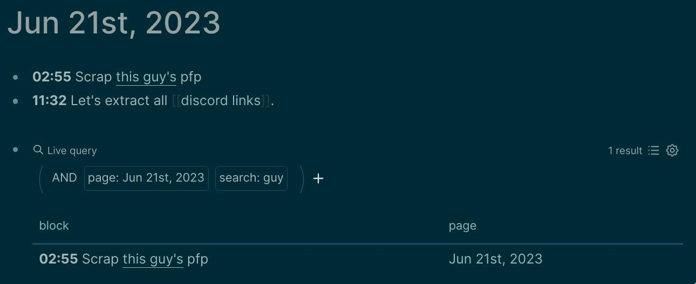

# 91.01 Note Taking

I use [Logseq](https://logseq.com) for all my personal notes. It embraces both [inter-linking](https://docs.logseq.com/#/page/how%20to%20create%20pages%20in%20logseq) and [hierarchial](https://blog.logseqmastery.com/post/logseq-namespaces) approach.

[What's so special about Logseq?](https://youtu.be/oBtKHwFBn0k) is a great video.

## Notes on logseq

* The fundamental unit of information is a block, not a file.
* Access all commands using `/`. Insert all types of formattable blocks using `<`.
* Access all the pages using `C-k`.
* Both markdown and emacs org-mode is well supported.
* All types of blocks, pages, rich text document (pdf), video or image are embeddable. Use the same `/` to embed anything, drag-n-drop works too.
* All operations over block can be viewed by right-clicking on block dot (at the very-left).
* Use `Alt+Shift+Up/Down` to move any block up or down.
* Page / Block links can also be viewed / edited on-the-fly by hovering over it.
* [50 Logseq Tips](https://youtu.be/r_tcDooayOo) is also a great video after understanding these fundamentals.
* Query is very powerful. It's both click-and-build as well as [write-as-a-dsl](https://qwxlea.github.io/#/page/datalog%2Fintro%20to%20datalog).  
  

### Favourite third party plugins

* [Vim Shortcuts](https://github.com/vipzhicheng/logseq-plugin-vim-shortcuts) plugin adds much more than vim shortcuts. You can mark (`<num>m`) or jump-to (`<num>'`) a block. Adds `C-/` for emoji picker, and sg/ss/sh/sy/se to quickly search block under cursor on google/stackoverflow/github/yt/wikipedia.

* [Logseq Markmap](https://github.com/vipzhicheng/logseq-plugin-mark-map) plugin can generate mindmap from the current page.

* [Logseq Quick Capture](https://chrome.google.com/webstore/detail/logseq-quick-capture/hdpmdgiddmjppbeahnglgagndmahlanc) browser extension lets you quickly capture things in your journal with single-click.

## References

for building a good structured note-taking and self-management system.

* [Getting Things Done + Personal Knowledge Management](https://fortelabs.com/blog/gtd-x-pkm). ⭐
* [Johnny Decimal System](https://johnnydecimal.com/10-19-concepts/11-core/11.01-introduction) - A rigid model for hierarchial approach.
* [GTD and a Second Brain: The Ultimate PKM System](https://facedragons.com/productivity/gtd-and-second-brain).
* [List of PKM Systems](https://www.reddit.com/r/PKMS/comments/nfef59/list_of_personal_knowledge_management_systems) (although a bit outdated).

### A note on my personal method

I don't believe in Quantized Self (measuring every single thing in life including blood pressure and stuffs like that).

But I firmly believe that dumping stuffs in an effortless / frictionless input (journal) than keeping it in brain is great for connecting dots and forming great ideas. With addition to an efficient retrieval, its a major upgrade.
