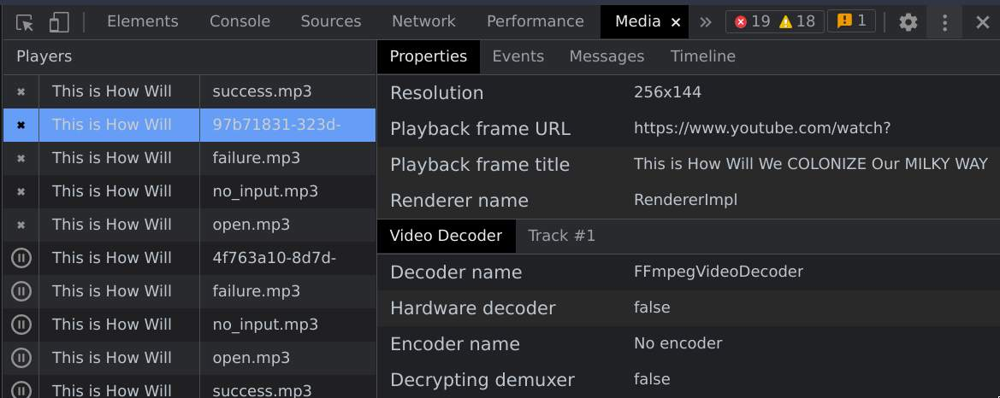
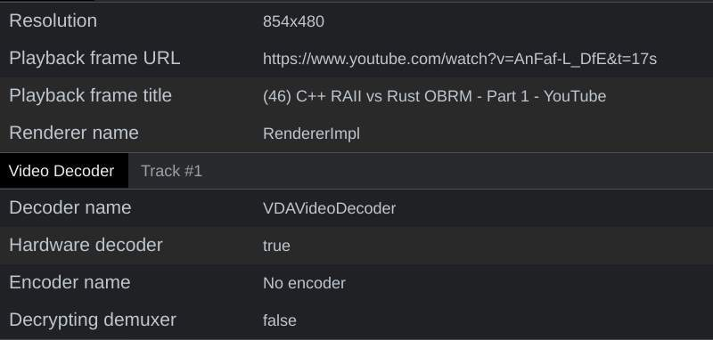
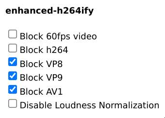

<h1>{{ $frontmatter.title }}</h1>

::: info Note
*A lot of commands listed here uses xbps (VoidLinux's package manager) for installation purposes, package names may vary distro to distro.*
:::

## Good to know Keybinds

### Terminal

```lua
Ctrl+l          clear
Alt+l           ls
Alt+s           toggles `sudo`
{Ctrl+w,Alt+d}  {backspace,delete} whole word
Ctrl+{u,y}      copy/paste currently written
Alt+e           edit currently written ($EDITOR)
```

### (N)Vim

```lua
Abbreviation: <C> === Ctrl  <A> === Alt  <S> === Shift
Notation: ^T === <C-t> === Ctrl-t

:5                Goto 5th line
5|                Goto 5th character on current line
f+<x>             Goto next occurrence of the character x  (previous: F)
t+<x>             Goto character just before next occurrence of the character x (previous: T)
;                 Repeat last f/t-<x> command
<<|>>|==          Tab in normal mode (== is smart add/reducer)
gg=G              Reindent whole file (gg & =G), similarly ggyG to yank file
"                 Access any register (+ being system clipboard); "+p and "+y being paste and copy respectively
viw | diw | yiw   Visual/Delete/Yank inside (a) word
v|V|<C-v>         Visual / LineVisual / VisualBlock mode
*|#               Search next/prev occurrence of currently focused word
<C-o>|<C-S-i>     Next/Prev location of jump, in find (/)
<C-d>|<C-u>       Next/Prev function (not that important)
```


## Battery Saving

### Install auto-cpufreq

<blockquote>
CPU scaling algorithm built-in are not very efficient, auto-cpufreq is ranked to be the best frequency (GHz) scaler, downscales the CPU quickly depending on the current usage of the CPU. It usually results in approx 25-30% more battery life.
</blockquote>

```bash
git clone https://github.com/AdnanHodzic/auto-cpufreq.git
cd auto-cpufreq && sudo ./auto-cpufreq-installer
```

And follow on-screen instructions.

Optionally you can restrict your CPU to go power-save and turn off turbo by writing the following at `/etc/auto-cpufreq.conf`:

```
[charger]
governor = performance
turbo = auto

[battery]
governor = powersave
turbo = off
```

& restarting the service: `sudo sv restart auto-cpufreq` after editing the file to make the changes take effect.

*Note: On intel CPU, scaling is governed by a kernel option, in order for auto-cpufreq to work properly, you may need to set the kernel flag listed below in [Kernel flags](#kernel-flags) section.*

### Enable Hardware Acceleration (Browser / Video Playback)

<blockquote>
Hardware acceleration reduces significant load from the CPU, sometimes making battery life upto more than 100%, while using media.
</blockquote>

CLI flags (e.g. `~/.config/brave-flags.conf`) should match approximately these:

```
--force-dark-mode
--enable-features=VaapiVideoEncoder,VaapiVideoDecoder,CanvasOopRasterization,TouchpadOverscrollHistoryNavigation,WebUIDarkMode
--enable-zero-copy
--use-gl=desktop    # =egl on wayland
--ignore-gpu-blocklist
--enable-oop-rasterization
--enable-raw-draw
--enable-gpu-compositing
--enable-gpu-rasterization
--enable-native-gpu-memory-buffers
--use-vulkan
--disable-features=UseChromeOSDirectVideoDecoder
--disable-sync-preferences
--force-device-scale-factor=1.5
--password-store=basic    # disables kwallet (optional)
```

Also, *optionally* enable these two flags by navigating into these addresses:<br>
chrome://flags/#enable-raw-draw<br>
chrome://flags/#enable-vp9-kSVC-decode-acceleration

Now everything should be green in chrome://gpu except for compositor rendering.

If not, possibly graphic drivers are missing, install appropriately for your GPU *(may require a reboot to take effect)*:

```bash
# Intel
sudo xbps-install mesa-intel-dri mesa-vaapi intel-video-accel
echo '[ -f /usr/lib64/dri/iHD_drv_video.so ] && export LIBVA_DRIVER_NAME=iHD' >> ~/.bashrc
echo 'if [ -f /usr/lib64/dri/iHD_drv_video.so ]; set -x LIBVA_DRIVER_NAME iHD; end' >> ~/.config/fish/config.fish

# AMD
sudo xbps-install mesa-ati-dri
```

Yet still sometimes video decoding doesn't work, to check either go to
* Media section in chrome's inspect panel (F12/Right-Click)
* OR navigate to chrome://media-internals

while playing a video and see if error is empty, `Hardware decoder: true` and `Decoding name: VDAVideoDecoder`.

<div style="display: flex; flex-direction: row;">
  
  
</div>

If not, first try using [enhanced-264ify](https://chrome.google.com/webstore/detail/enhanced-h264ify/omkfmpieigblcllmkgbflkikinpkodlk) extension with following blocks:



That should make low-resolution videos (<720p) forcefully use h264 which can be hardware-decoded.

If still not showing hardware decoding, you may need to build `intel-media-driver` with nonfree kernel-option (Or check if nonfree repository on your distro redistribute this pkg) as pointed out by [this comment](https://github.com/saiarcot895/chromium-ubuntu-build/issues/98#issuecomment-757710499).
```bash
./xbps-src -o nonfree pkg intel-media-driver
```

### Tune your USB peripherals

<blockquote>
PowerTop is majorly a power resource monitor, yet it provides a tuning option which can significantly reduce your power consumption, may result in upto 5-10% more battery life.
</blockquote>

```bash
sudo xbps-install powertop
sudo powertop --autotune   # Do everytime laptop boots, or make a startup script
```

## Kernel flags

Set the following parameters (in `/etc/default/grub`) to ensure:
* Kernel throws good amount of information to debug if sth went wrong.
* Sleep states work perfectly.
* Wireless & Ethernet device names are traditional (wlan0/eth0) rather than some dynamic names (e.g. wlp3s0).
* Panel self refresh is on (Intel).
* Intel's pstate is turned off, so auto-cpufreq can take over.
* NVME acpi is required on very new SSD to work, but it compromises battery on other laptops, should be turned off if possible by setting noacpi=1.

```
GRUB_CMDLINE_LINUX_DEFAULT="loglevel=4 acpi_osi='Windows 2020' net.ifnames=0 i915.enable_psr=1 intel_pstate=disable nvme.noacpi=1"
```

After every edit, you must run `sudo update-grub` in order for the changes to take effect in next boot.

## Cassowary (100% Windows App compatibility)

Unlike [Wine](https://www.winehq.org), which often breaks itself when you need something like two applications co-working together or when you need to use applications like MS Word or any Heavy video-editor which extensively uses Win32 and Microsoft APIs, The [Cassowary](https://github.com/casualsnek/cassowary) will fully support running all of them with native experience.

Under the hood, it'll use a Windows VM which can autosuspend itself when not under use to lower the power consumption while giving back 100% application compatibility without any hard to setup path. You can make windows installation as custom as you like, you just need to turn on RDP and install cassowary guest tools for forwarding the application to your linux host and make application shortcuts for directly opening them.

I'd be using [quickemu](https://github.com/quickemu-project/quickemu) for quickly setting up the VM without hassle... Prebuilt void-pkg is [here](https://github.com/Animeshz/void-xpackages). Use gpu passthrough helper for GPU forwarding (optional).
```bash
sudo xbps-install quickemu spice-vdagent

# Find for your distro here: https://github.com/pavolelsig
git clone https://github.com/oSoWoSo/passthrough_helper_void && cd passthrough_helper_void
chmod +x *.sh
sudo ./gpu_passthrough.sh

quickget windows 10
echo 'cpu_cores="4"' >> windows-10.conf  # optional
echo 'port_forwards=("7220:7220")' >> windows-10.conf
quickemu --vm windows-10.conf --display spice

# Download & Install for copy paste (in Windows VM)
# https://www.spice-space.org/download/windows/spice-guest-tools/spice-guest-tools-latest.exe

# Enable RDP & Change RDP Port to 7220 (in Windows VM)
# Win+I -> System -> Remote Desktop

sudo xbps-install freerdp libvirt-python3
pip install PyQt5

wget https://github.com/casualsnek/cassowary/releases/download/0.6/cassowary-0.6-py3-none-any.whl
pip install cassowary*

python3 -m cassowary -a
# Set VM IP as `127.0.0.1`, rest from get from rdp settings and `hostname` command in cmd/powershell.
# Save Settings & Reconnect
# Goto: Guest app, and create shortcuts
```


## Extras

* [Chromium - MacOS like pinch zoom (not scaling like Ctrl+ Ctrl-)](https://www.reddit.com/r/linux/comments/rmuh0o/finally_macoswindows_like_touchpad_zoom_gesture)
